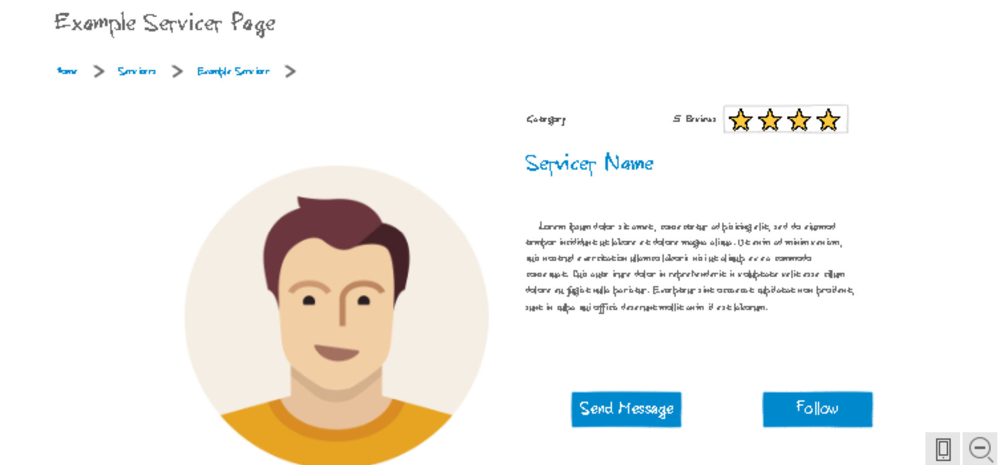
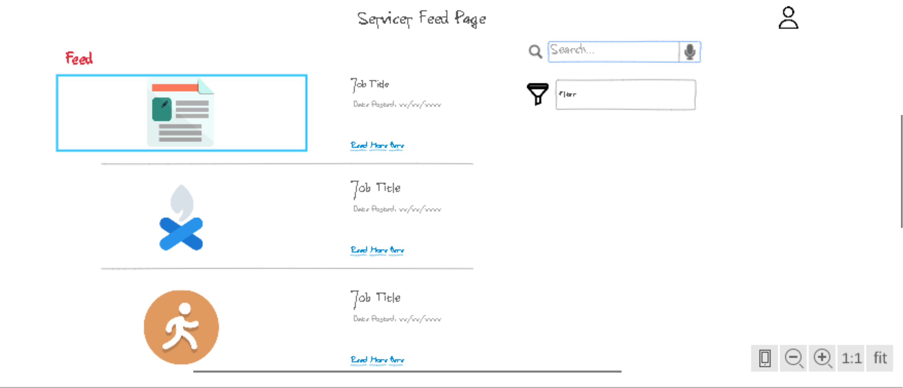

# Bargo Jobs

## Elevator Pitch
When it comes to taking care of the jobs that you need done, there isn't anything that gets in the way more than needing to reach out to dozens of servicers to compare prices, quality, and timelines. With Bargo Jobs, we focus on eliminating the time it takes to get your jobs done. Like a social media platform, Bargo connects clients with servicers and uses your preferences to find you the very best ones for the job. At Bargo Jobs, we help your dreams become reality.

## Design
The website will function similar to a simple social media site, where both servicers and clients can create accounts and start connecting with one another. Clients will create listing for jobs that they need done and include informations about the project. Bargo will then find servicers in the area that will be a good fit and give them the opporunity to contact the client and begin negotiating their offer. Once both parties are agreed and locked in, the client pays the servicer and they move forward completing the project. 

### Sketches
A simple servicer page may look something like this:

Clients can leave reviews, follow, or message servicers directly. 

A servicers feed will be populated with potential jobs they may be interested in:

## Key Features
* Secure login through HTTP
* Ability for users to modify profiles
* Live feed updates
* Search bar and filtered lists
* Direct messaging between clients and servicers
* Personalized feeds
* Rate/Review system for both clients and servicers
* Job listing creation for clients
* Payment Management
* Contract generation for users

## Technologies
The following technologies will be implemented in the following ways.

- **HTML** - Uses correct HTML structure for application. Multiple HTML pages for clients and servicers. This include pages for reviews, listings, feeds, and messaging.
- **CSS** - Application styling that looks good on different screen sizes, uses good whitespace, color choice and contrast.
- **JavaScript** - Allows application to display resources dynamic and adjust styling as needed. Makes all backend calls and webservice calls. I plan use webservices to help with location data and calculating distances.
- **Service** - Backend service with endpoints for:
  - login
  - creating an account
  - making payments
  - posting a job listing
- **DB** - Store users, listings, feeds, and messages in database.
- **Login** - Register and login users. Credentials securely stored in database. Users may browse but are unable to create job listings or make offers on jobs without logging in.
- **WebSocket** - As clients and servicers communicate through messaging, web sockets send live data.
- **React** - Application ported to use the React web framework.

## HTML deliverable

For this deliverable I built out the structure of my application using HTML.

- **HTML pages** - Multiple HTML pages added to show general structure and layout of application
- **Links** - The login page automatically links to the feed page. All pages link to each other for now, although
there will be a difference between what pages customers and companies can see
- **Text** - Each page and item in page is given a description to represent how it will be used in the application
- **Images** - Images will be included for posts and companies
- **Services** - Location web service will be used to help calcuate distances as that will be a factor in what posts are shown to what company.
- **Login** - Input box and submit button for login.
- **Database** - Lots of things will use the database including the login page as well as messages, posts, account info, company info, etc.
- **WebSocket** - Messages and posts will be shown to users in real time.

## CSS deliverable

For this deliverable I properly styled the application into its final appearance.

- **Header, footer, and main content body** - Styling used throughout to give website a consistent and polished feel. 
- **Navigation elements** - Created a more traditional navigation bar.
- **Responsive to window resizing** - Used flex displays to ensure application can be resized.
- **Application elements** - Elements are styled to look good and make the user experience simple and intuitive.
- **Application text content** - Consistent fonts and color scheme.
- **Application images** - Uses correct styling for the included images on the website. Most of them are just placeholders.

## JavaScript deliverable

For this deliverable I implemented by JavaScript so that the application works for a single user. I also added placeholders for future technology.

- **login** - When you press enter or the login button it takes you to the feedpage and saves your username inside the localStorage. The username is used throughout the application.
- **database** - Displays messages, reviews, and feed all dynamically through the use of localStorage as a place holder for real database values
- **WebSocket** - I implemented a way to send messages and switch between inboxes. This will be replaced with WebSocket messages later.
- **application logic** - The application is much more complete now and users can interact with it in many different ways. This includes creating feed posts, replying to company reviews, and sending messages to other users.

## Service deliverable

For this deliverable I added backend endpoints that handle creating listings, writing messages, and replying to reviews

- **Node.js/Express HTTP service** - done!
- **Static middleware for frontend** - done!
- **Calls to third party endpoints** - I call a google maps webservice to embed a map into the company page
- **Backend service endpoints** - Placeholders for login that stores the current user on the server. Endpoints for messaging, creating listings, and replying to reviews
- **Frontend calls service endpoints** - Replaced calls to localStorage to instead call backend endpoints

## DB deliverable

For this deliverable I stored the data for users, listings, reviews, and messages in the database.

- **MongoDB Atlas database created** - done!
- **Endpoints for data** - Service endpoints now call database functions and create a connection to read information from the db to send as responses.
- **Stores data in MongoDB** - done!